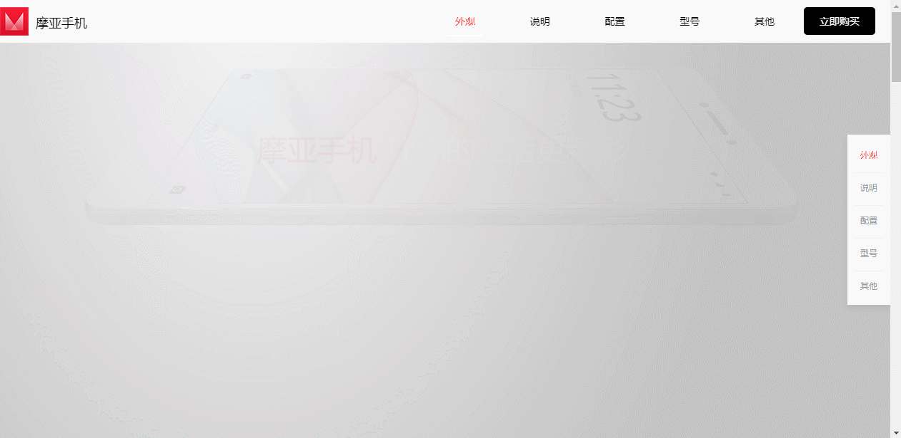
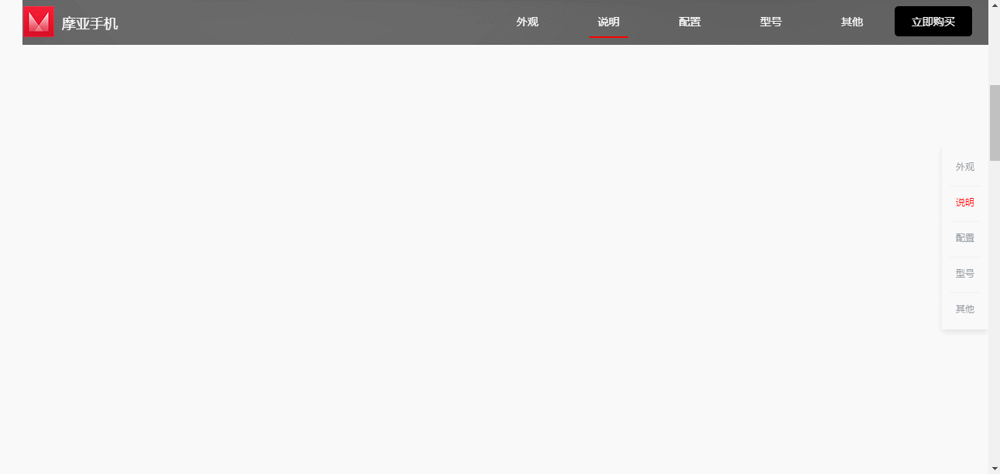
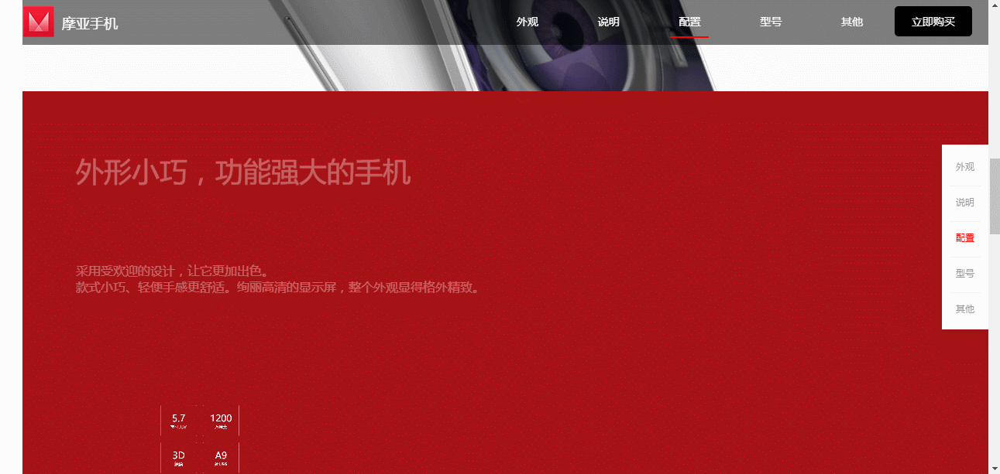
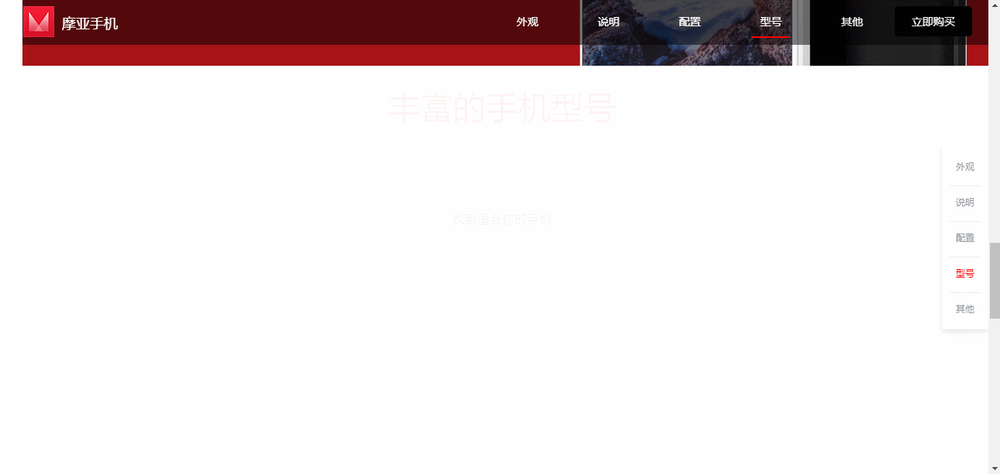
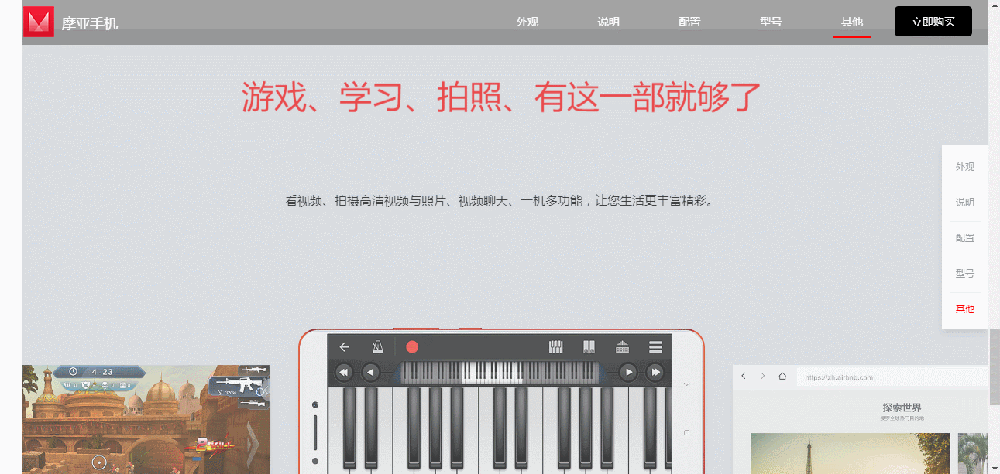
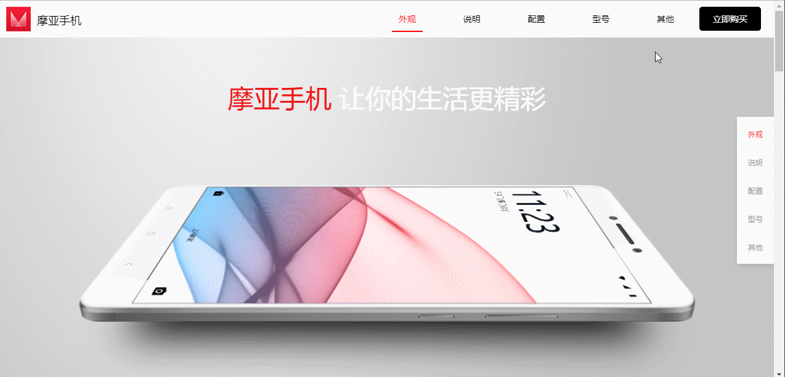

### 项目简介
这是一个动态的手机展示页，非常适合在电脑的大屏幕上浏览。每移动到一个板块的介绍，都有不同的动画特效。最后，你还可以点击购买按钮，选择你喜欢的手机型号以及购买数量。

项目地址：[点击这里](https://liaozeen.github.io/productDisplay)

### 效果展示
- 动画特效部分

- 商品购买弹窗

### 项目技术重点和难点

#### 1、动画特效

本项目有大量的动画特效，主要分为两种动画实现方式：过渡动画-transition和帧动画-animation。

只有初始和结束两种状态的动画用过渡动画实现，有多个状态的动画用帧动画实现。本项目需要使用帧动画的动画为循环缩放的红圈和左右摆动的数字，其他的均为过渡动画。

过渡动画实现思路：
- 创建新的CSS文件来管理动画元素的样式，便于维护和修改
- 为每个有动画的元素设置初始样式和结束样式，分别以后缀为_init 和 _done命名
- 网页初始化或刷新时，利用JS为所有动画的元素添加后缀为_init的class属性，即设置动画元素的初始样式
- 使用window.onscroll跟踪滚轮条的位置，根据滚轮条到顶部的距离，为相应的动画元素添加后缀为_done的class属性，并删除 _init的class属性，即设置动画元素的结束样式，实现动画

这里又延伸一些知识点：
- 元素的获取：document.querySelector()和document.querySelectorAll()
- 元素样式的获取：element.getAttribute()
- 元素样式的设置：element.setAttribute()
- 遍历元素：for...of

#### 2、双向导航
本项目有两个导航，一个在顶部，一个在右侧边。两个导航的实现的功能是一样的，而且点击任意一个导航，另一个导航的样式也会变化。

原先是想利用srollTop属性获取和设置滚轮条的位置，再给每个按钮绑定点击事件。经过多次尝试，发现用srollTop设置滚轮条的位置始终实现不了。

最终改用< a>锚点来解决元素定位问题，结果发现代码更少，少了些复杂的逻辑。而导航样式的改变则利用window.onscroll，为当前的板块对应的按钮添加新样式

#### 3、购物车
购物车主要实现的是用户可以选择手机的型号以及数量，并实时显示用户已选择的选项以及总价。

优化：购物车上有很多需要点击的地方，如果每个都绑定点击事件，会占用内存，影响网页性能。我们可以利用事件冒泡，提供事件委托的解决方案。只绑定一个事件处理程序，来管理所有的点击事件。

相关知识点：
- 表单
- 事件委托
- 元素CSS样式的设置：element.style
- 条件语句：switch
- 模板字符串
- 字符串的方法：replace

